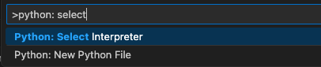
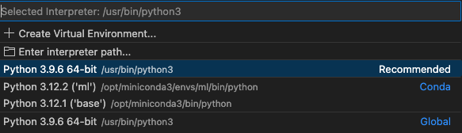

# Install miniconda
Install miniconda https://docs.anaconda.com/free/miniconda/

## Common Commands
Create new env
```bash
conda create --name myenv python=3.12
```
Activate env
```bash
conda activate myenv
```
Deactivate env
```bash
conda deactivate
```
List all env
```bash
conda env list
```
Remove env
List all env
```bash
conda env remove --name myenv
```
Install Package
```bash
conda install numpy
```
Remove Package from current env
```bash
conda remove numpy
```
After uninstalling packages or an environment, it’s a good practice to clean up unused packages and caches to free up disk space:
```bash
conda clean --all
```

## Install JupyterLab with conda
```bash
conda activate myenv
conda install -c conda-forge jupyterlab
jupyter-lab
```

# Install VS Code
Install https://code.visualstudio.com/Download

## Extensions
- python from Microsoft
- Markdown All in One
  - use cmd + k, v to open preview on the side
- Jupyter from Microsoft
  - Ctrl+Shift+P and select Jupyter: Create New Jupyter Notebook
  - Ctrl+Shift+P enter python: select interpreter 
  - Then select your conda env 